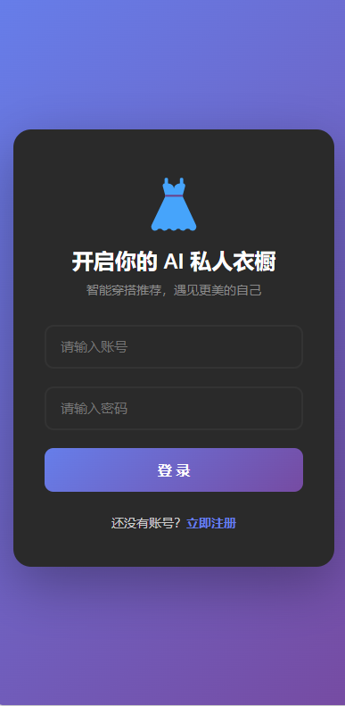
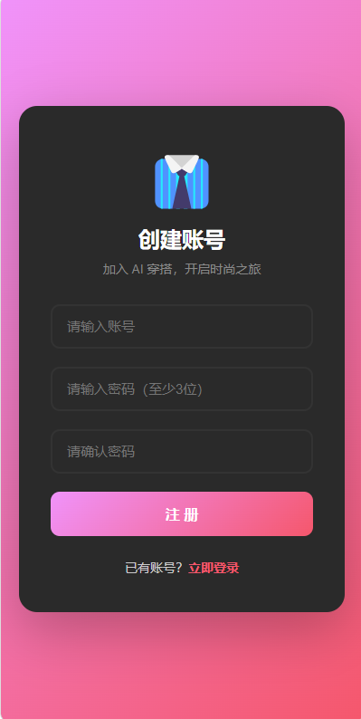
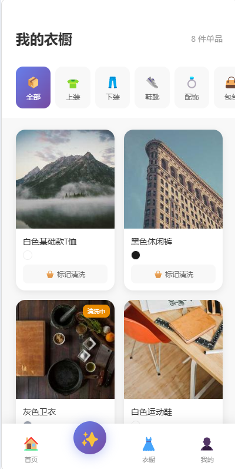
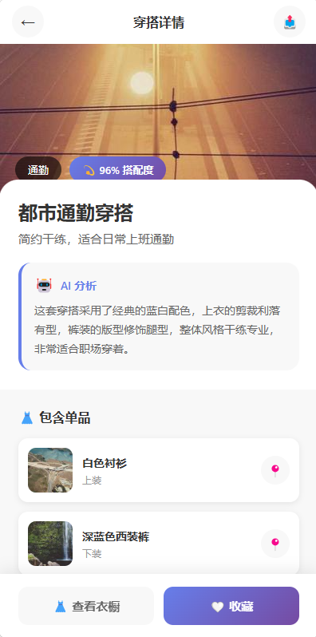
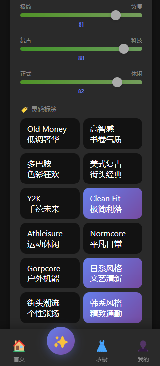
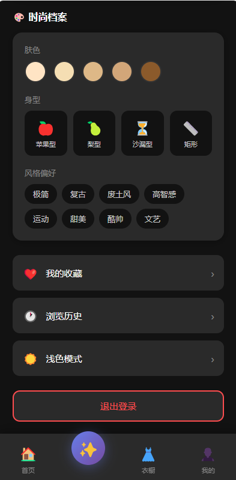
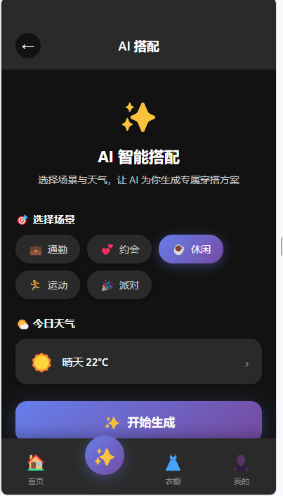
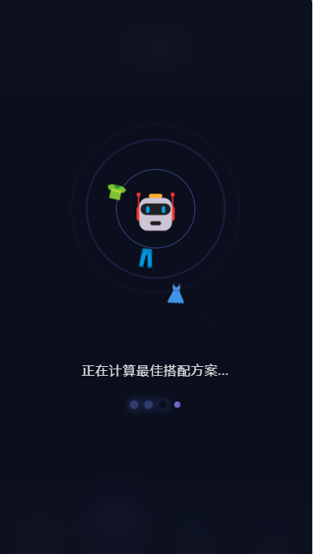
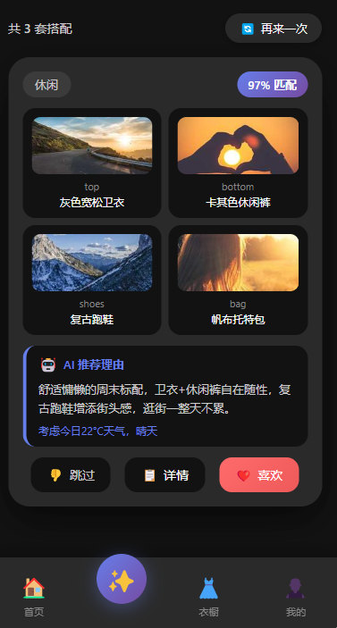

# 👗 AI Style - AI 穿搭助手

> **"不仅是衣橱，更是你的 AI 穿搭策略中心"**

[](https://vuejs.org/)
[](https://pinia.vuejs.org/)
[](https://router.vuejs.org/)
[](LICENSE)

---

## 📱 项目预览

### 核心功能展示

| 登录注册 | 注册页面 | 首页推荐 |
|:--------:|:--------:|:--------:|
|  |  |  |

| AI 搭配 | 生成动画 | 衣橱管理 |
|:--------:|:--------:|:--------:|
|  |  |  |

| 穿搭详情 | 个人中心 | 深色模式 |
|:--------:|:--------:|:--------:|
|  |  |  |

### AI 搭配页面展示

**三阶段交互流程：**

| ① 输入期 | ② 生成期 | ③ 结果展示 |
|:--------:|:--------:|:----------:|
| 场景选择 + 天气模拟 | 科技感动画 + 文案轮播 | 多套搭配卡片 + 滑动交互 |
|  |  |  |

---

## ✨ 项目特色

### 🎯 用户价值

| 特色 | 说明 |
|------|------|
| 🤖 **AI 智能搭配** | 全新 AI 搭配专页，三阶段交互动画，5 大场景匹配（通勤/约会/休闲/运动/派对），多套搭配卡片支持滑动浏览 |
| 🌤️ **天气感知** | 模拟天气影响穿搭推荐，为每种搭配生成天气适配说明 |
| 👗 **数字化衣橱** | 拍照/相册录入衣服，分类管理（上下装/鞋靴/配饰/包包），支持"清洗中"状态标记 |
| 📷 **头像上传** | 支持 JPG/PNG 格式，2MB 限制，Base64 本地存储，压缩优化 |
| 💾 **本地持久化** | 使用 localStorage 存储数据，无需后端即可完整体验所有功能 |
| 📱 **移动端优先** | 响应式设计，适配各种屏幕尺寸，支持深色模式 |
| ⚡ **性能优化** | 图片懒加载、组件按需渲染、流畅的交互动效 |
| 📳 **触觉反馈** | 移动端操作时的震动反馈，提升交互质感 |

### 🛠️ 技术亮点

- **AI 搭配三态流转**：输入 → 生成动画 → 结果展示，状态机驱动，组件解耦
- **统一接口设计**：`USE_MOCK` 一键切换 Mock / 真实后端，store 无需感知数据来源
- **Pinia 状态管理**：5 个 store 模块（auth / wardrobe / outfit / user / theme），数据流清晰
- **组件化架构**：`biz/` 业务组件目录，MatchFilter / AIThinking / OutfitCard 高度解耦
- **Mock 数据设计**：异步 API 封装（2.5s+ 延迟模拟网络），覆盖 5 场景 × 3 套 = 15 套搭配
- **CSS 变量主题**：一套代码支持亮/暗主题切换

---

## 🏗️ 架构与设计

### 技术栈

```
┌─────────────────────────────────────────────────────────┐
│                      Vue 3 (Composition API)            │
│                      <script setup>                     │
├─────────────────────────────────────────────────────────┤
│  ┌──────────┐  ┌──────────┐  ┌────────────────────────┐ │
│  │ Vue      │  │ Pinia    │  │    Vue Router          │ │
│  │Components│  │ Stores   │  │    (Route Guards)      │ │
│  └──────────┘  └──────────┘  └────────────────────────┘ │
├─────────────────────────────────────────────────────────┤
│                   localStorage (Mock Data)              │
└─────────────────────────────────────────────────────────┘
```

### 目录结构

```
src/
├── components/            # 公共组件
│   ├── biz/               # 业务组件（AI 搭配模块）
│   │   ├── MatchFilter.vue   # 场景/天气选择器
│   │   ├── AIThinking.vue    # 生成期动画组件
│   │   └── OutfitCard.vue    # 搭配结果卡片
│   ├── BottomNav.vue      # 底部导航栏
│   ├── BottomSheet.vue    # 底部弹出菜单
│   └── ClothingDetail.vue # 衣服详情弹窗
├── composables/          # 组合式函数
│   └── useHaptics.js     # 触觉反馈
├── router/
│   └── index.js          # 路由配置 + 全局守卫
├── stores/               # Pinia 状态管理
│   ├── auth.js           # 用户认证
│   ├── wardrobe.js       # 衣橱数据
│   ├── outfit.js         # AI 搭配状态（新增）
│   ├── user.js           # 用户档案/收藏/历史
│   └── theme.js          # 主题管理
├── services/             # API 服务层
│   ├── api.js            # API 配置（base URL + 超时）
│   ├── outfit.js         # AI 搭配接口（Mock + 真实）
│   └── user.js           # 用户头像/档案接口
├── views/                # 页面视图
│   ├── LoginView.vue
│   ├── RegisterView.vue
│   ├── HomeView.vue      # AI 推荐首页（滑动卡片）
│   ├── OutfitMatchView.vue  # AI 搭配专页（新增）
│   ├── WardrobeView.vue  # 衣橱管理
│   ├── OutfitDetailView.vue # 穿搭详情
│   ├── AddClothView.vue  # 录入新单品
│   ├── ProfileView.vue   # 个人中心
│   ├── LikedView.vue     # 收藏列表
│   └── HistoryView.vue   # 浏览历史
└── App.vue
```

### 设计原则

> **API 优先，Mock 后备**：所有 API 调用采用异步 Promise 封装，`USE_MOCK` 标志一键切换 Mock / 真实后端。

```
Mock 模式: generateOutfit() → generateOutfitMock() → 2.5s+ 延迟 → 15 套搭配
真实模式: generateOutfit() → generateOutfitReal() → getAIOutfit() → POST /api/outfit/recommend
```

### AI 搭配接口约定

| 项目 | 说明 |
|------|------|
| 统一入口 | `generateOutfit({ scene, weather, wardrobeIds })` |
| 返回格式 | `{ outfits: [{ outfitId, top, bottom, shoes, accessory, reason, matchRate, scene }] }` |
| Mock 地址 | 本地函数，无需后端 |
| 真实地址 | `POST /api/outfit/recommend` |
| 请求体 | `{ scene: "casual", wardrobeIds: [1, 2, 3] }` |
| 切换方式 | `services/outfit.js` → `USE_MOCK = false` |

### AI 搭配状态流转

```
   ┌──────────┐   点击生成   ┌───────────┐   2.5s后    ┌──────────┐
   │  INPUT   │ ──────────→  │ GENERATING│ ─────────→  │ RESULTS  │
   │ 场景选择  │             │ 动画+轮播  │            │ 卡片叠层  │
   └──────────┘              └───────────┘             └──────────┘
        ↑                                                │
        │             全部滑完 / 再来一次                │
        └────────────────────────────────────────────────┘
```

---

## 🚀 快速开始

### 环境要求

- **Node.js**: `>= 16.0.0`
- **npm**: `>= 8.0.0` 或 **yarn**: `>= 1.22.0`

### 安装步骤

```bash
# 克隆项目
git clone <repository-url>
cd demo

# 安装依赖
npm install

# 启动开发服务器
npm run serve

# 构建生产版本
npm run build
```

### 启动成功

```
App running at:
  - Local:   http://localhost:8080/
  - Network: http://192.168.x.x:8080/
```

---


## 📖 开发规范

### 命名约定

| 类型 | 规范 | 示例 |
|------|------|------|
| 组件文件 | 大驼峰 (PascalCase) | `BottomNav.vue`, `OutfitCard.vue` |
| 视图文件 | 大驼峰 + View | `HomeView.vue`, `OutfitMatchView.vue` |
| 业务组件 | `biz/` 目录下大驼峰 | `biz/MatchFilter.vue`, `biz/AIThinking.vue` |
| 工具函数 | 小驼峰 (camelCase) | `useHaptics.js` |
| Store 文件 | 语义化命名 | `auth.js`, `wardrobe.js`, `outfit.js` |

### 文件组织原则

```
stores/       → 状态管理，所有数据操作集中于此
composables/  → 可复用逻辑，跨组件共享
components/   → 可复用组件（biz/ 为业务组件）
views/        → 页面级组件，组合业务逻辑
services/     → API 接口封装，Mock 与真实统一管理
```

### Mock 数据说明

> ⚠️ **重要**：所有用户数据存储在浏览器 `localStorage` 中

| Key | 说明 |
|-----|------|
| `token` | 登录凭证（临时 Mock） |
| `currentUser` | 当前用户信息 |
| `mock_users` | 所有注册用户数据 |
| `user_profile` | 用户时尚档案 |
| `theme` | 主题偏好 (light/dark) |

**重置数据**：清除浏览器缓存或执行 `localStorage.clear()`

---

## 🗺️ 开发路线图

### 已完成 ✅

- [x] 用户认证系统（登录/注册/Mock 验证）
- [x] 路由守卫（未登录重定向）
- [x] 底部导航栏（3 Tab + 悬浮按钮 + AI 搭配入口）
- [x] AI 搭配专页（场景选择 → 生成动画 → 卡片叠层 → 滑动交互）
- [x] AI 推荐首页（场景选择 + 卡片滑动）
- [x] 衣橱管理（分类 + 网格 + 详情）
- [x] 单品录入（拍照/相册选择）
- [x] 个人中心（时尚档案 + 收藏 + 历史）
- [x] 用户头像上传（校验/预览/压缩）
- [x] 穿搭详情页
- [x] 深色模式支持
- [x] 触觉反馈
- [x] Pinia outfit store（搭配状态管理）
- [x] Mock 接口统一封装（USE_MOCK 一键切换）

### 待开发 📋

- [ ] 后端 API 对接（`USE_MOCK = false` 即可启用）
- [ ] 真实用户认证（JWT）
- [ ] 社交分享功能
- [ ] 穿搭日历
- [ ] 推送通知
- [ ] 天气 API 真实接入

---

## 🤝 参与贡献

1. **Fork** 本仓库
2. **创建分支** (`git checkout -b feature/AmazingFeature`)
3. **提交更改** (`git commit -m 'Add some AmazingFeature'`)
4. **推送分支** (`git push origin feature/AmazingFeature`)
5. **创建 Pull Request**

---

## 📄 许可证

本项目基于 [MIT License](LICENSE) 开源。

---

## 📞 联系方式

- **项目作者**: Your Name
- **邮箱**: your.email@example.com
- **问题反馈**: [GitHub Issues](https://github.com/your-username/demo/issues)

---

> 💡 **提示**：如果项目对你有帮助，欢迎 Star ⭐️
